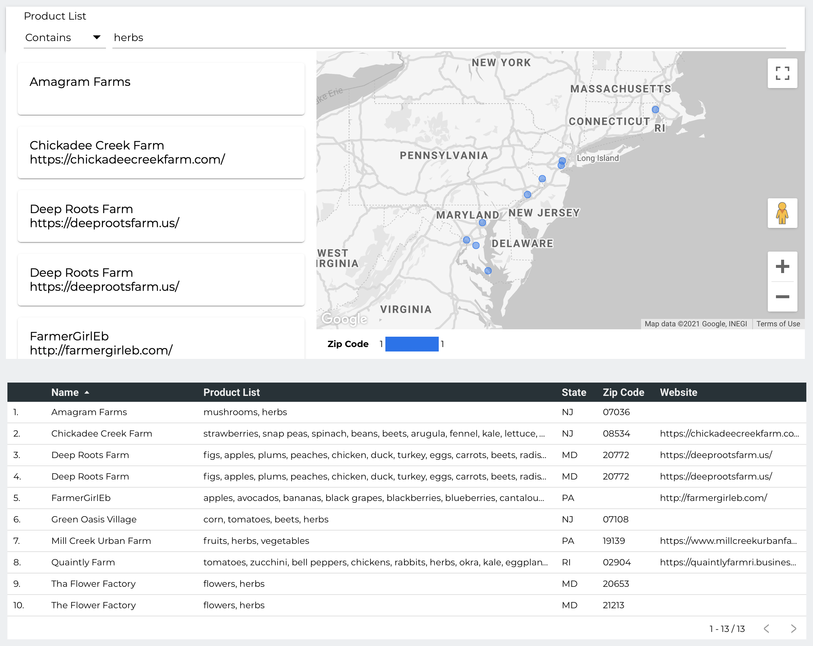
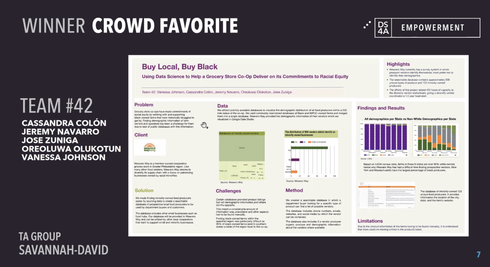

For the past 13 weeks, I spent my Saturdays on Zoom absorbing as much data knowledge and skills as I could thanks to the efforts of *“Correlation One's”*  [Data Science for All](https://bit.ly/3lYh7jQ) program.  This was an initiative geared to bring historically underrepresented groups into the data science field. While attending lectures by Harvard professors - **shout out to Natesh Pillai** - and other amazing guest lecturers, we were then divided into groups and tasked with developing a data science project. 

My team decided to focus on solving a local data need; We focused on helping a Philadelphia based grocery co-op, Weavers Way, take steps to diversify their supply chain. Given that a team member, VJ, was a member of the coop, we had the opportunity to allow our data journey have direct impact on the community.  

Our solution was to find and visualize demographic data about local food growers, vendors, and producers and to create a searchable database.  The visualization gives context on the racial demographics of the market of local food producers (over 90% of farmers in the 9 Northeastern states were white). This database enhances current practices and allows the coop to save time - over 400 hours of our collective team's work - while also taking a more proactive approach to identifying new vendors. Below is a screenshot of the vendor search capability. 

Creating the vendor lookup took hours of data wrangling and cleaning and the process of creating it was not without its challenges, but the end product is something that all five of us were very proud of.  We presented our work to our TA group and given the direct impact we were having with our client, we received crowd favorite and even got a shout from Run the Jewels' Killer Mike on [Twitter](https://twitter.com/KillerMike/status/1360814811739811842). 

Overall, I feel like I have grown my data science knowledge tremendously since the start of the DS4A program and it has led me to strongly consider a career path in data science; So much so that in 2 weeks I am starting a new learning journey with Anaplan to become a certified Anaplan model builder. Hopefully this opens the door to new opportunities. 
